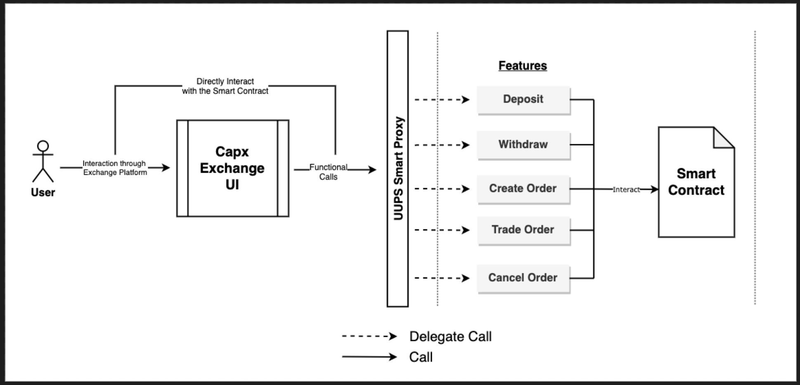
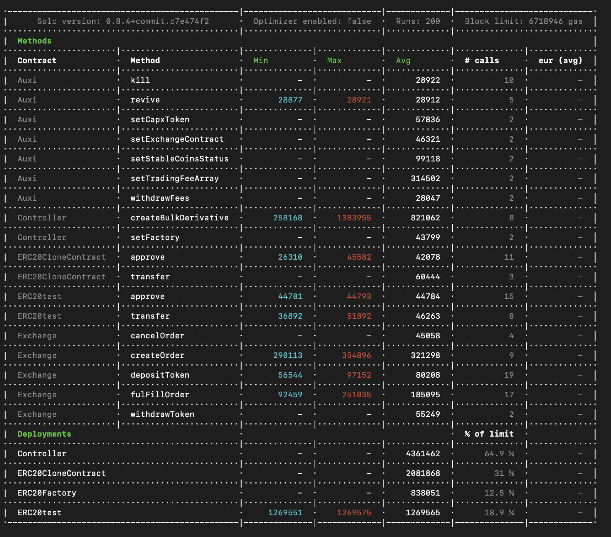
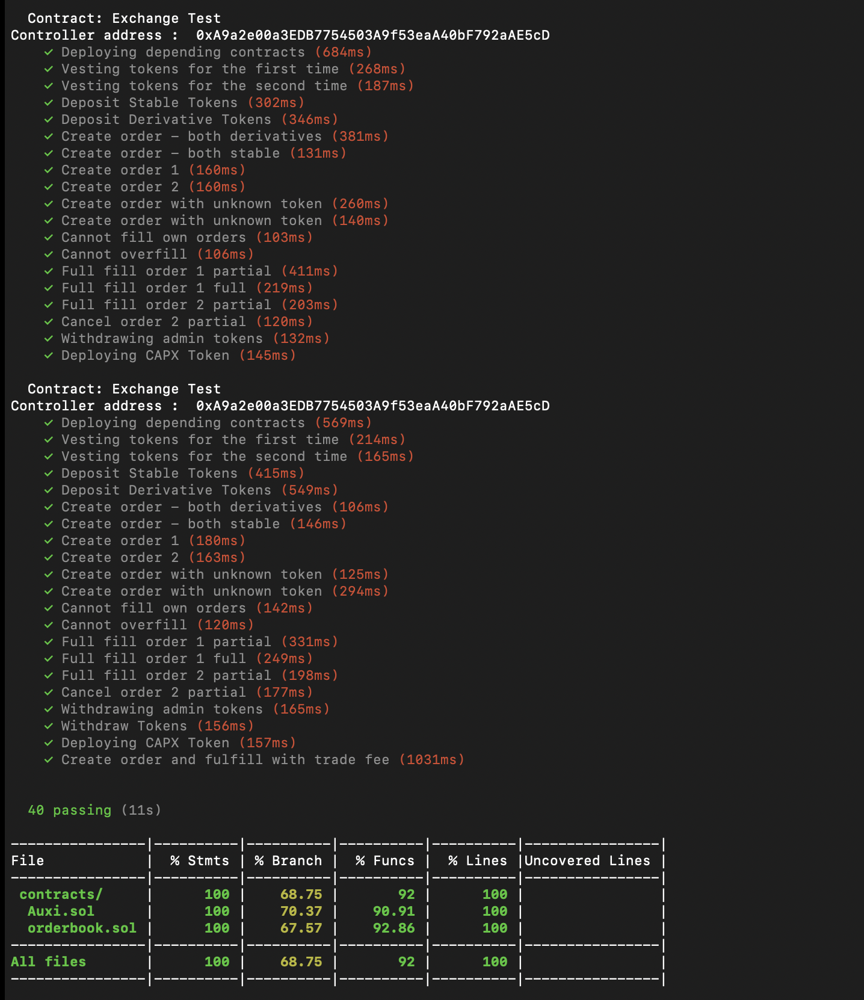
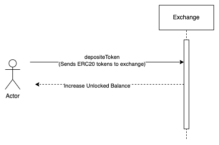
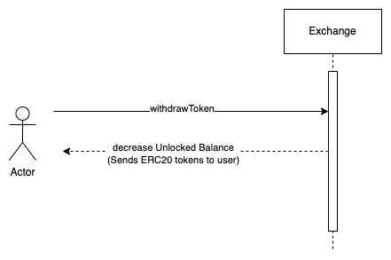
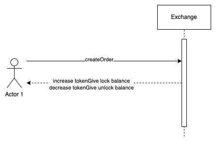
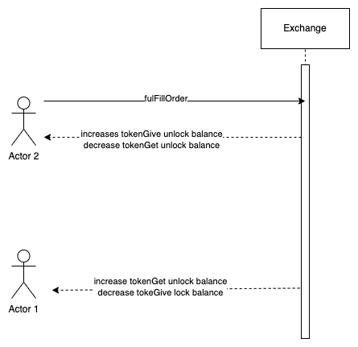
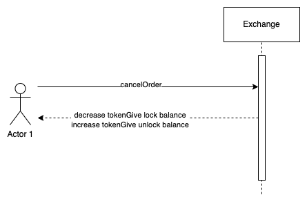

Derivative Asset Exchange 
====================================

The project provides a decentralized platform allowing users to post orders on an onchain order book. Users can post 'buy and sell' orders on the order book with an expiry time<br />
This creates a completely decentralised community for peer-2-peer exchange for the secondary markets at a high level. This is unlike a traditional exchange, that has all of its business logic defined and is executed on a private server owned by a company.

Architecture
-------------------



Deploying the Smart Contracts
================================

The deployment script is written in the migrations file "1_initial_migration".
This project has total of 2 contract which are deployed using openzeppelin upgradable which deploys the UUPS Smart Proxy contract and then deploys the implementation contract.

## How to deploy a contract in migration files

```js
const instanceVariable = await deployer.deploy(contractVariable, contructorArguments)
```

## Step 1

Importing the contracts

```javascript
const auxi = artifacts.require("Auxi");
const exchange = artifacts.require("Exchange");
```

## Step 2 

Gets the accounts to be used for deployment

```javascript
const accounts = await web3.eth.getAccounts();
```

## Step 3

Deploys auxi contract using openzeppelin upgradable plugin. 

```javascript
let auxiInstance = await deployProxy(auxi, [], { kind: 'uups' });
```

## Step 4

Deploys exchange contract using openzeppelin upgradable plugin. 

```javascript
let exchangeInstance = await deployProxy(exchange, [auxiInstance.address], { kind: 'uups' });
```

## Step 5

Setting Exchange contract address in the state variable of Auxi contract

```javascript
await auxiInstance.setExchangeContract(exchangeInstance.address);
```

### Run Migrate to deploy the contracts.
> truffle migrate

### Running test on the smart contract.

Using the `eth-gas-reporter` to report the gas consumption.

> truffle run test

Sample report.


Running with `coverage`

> truffle run coverage
Sample report.


Implementation Details 
======================

### Exchange Contract

Capx Exchange functions as a completely decentralised community peer-2-peer exchange for the secondary markets at a high level.
For more details see [Auxi.md](./ContractDocumentation/Auxi.md) and [Exchange.md](./ContractDocumentation/Exchange.md)

### Contract Address

#### Binance Smart Chain (BSC)
| Contract Name     | Contract Address  |
|---------------------|--------------------------------------------------------------------|
| Exchange   | [0x9148B64Da26d572290EE1C461A733f7857FAA599](https://bscscan.com/address/0x9148B64Da26d572290EE1C461A733f7857FAA599)	 |
| Auxi   | [0x463CdDd0f76C8bd7E70A73cdA1b9da2bcaB64FB1](https://bscscan.com/address/0x463CdDd0f76C8bd7E70A73cdA1b9da2bcaB64FB1)	 |

#### Matic (Polygon)
| Contract Name     | Contract Address  |
|---------------------|--------------------------------------------------------------------|
| Exchange   | [0x9148B64Da26d572290EE1C461A733f7857FAA599](https://polygonscan.com/address/0x9148B64Da26d572290EE1C461A733f7857FAA599)	 |
| Auxi   | [0x463CdDd0f76C8bd7E70A73cdA1b9da2bcaB64FB1](https://polygonscan.com/address/0x463CdDd0f76C8bd7E70A73cdA1b9da2bcaB64FB1)	 |

#### Avalanche
| Contract Name     | Contract Address  |
|---------------------|--------------------------------------------------------------------|
| Exchange   | [0x463CdDd0f76C8bd7E70A73cdA1b9da2bcaB64FB1](https://snowtrace.io/address/0x463CdDd0f76C8bd7E70A73cdA1b9da2bcaB64FB1)	 |
| Auxi   | [0x62286a4bfb9dfcbe5877d4c988fe08f613f3034d](https://snowtrace.com/address/0x62286a4bfb9dfcbe5877d4c988fe08f613f3034d)	 |

## Subgraph Query URLs

### Binance Smart Chain (BSC)

| Subgraph     | Query URL  |
|---------------------|--------------------------------------------------------------------|
| Exchange Subgraph   | https://api.thegraph.com/subgraphs/name/capxdev/capx-exchange-bsc	 |

### Matic (Polygon)

| Subgraph     | Query URL  |
|---------------------|--------------------------------------------------------------------|
| Exchange Subgraph   | https://api.thegraph.com/subgraphs/name/capxdev/capx-exchange-matic		 |

### Avalanche

| Subgraph     | Query URL  |
|---------------------|--------------------------------------------------------------------|
| Exchange Subgraph   | https://api.thegraph.com/subgraphs/name/capxdev/capx-exchange-avalanche	 |


Flow Diagrams
-------------------
#### Deposit tokens



#### Withdraw tokens



#### Create order



#### Fulfill order



#### Cancel order

